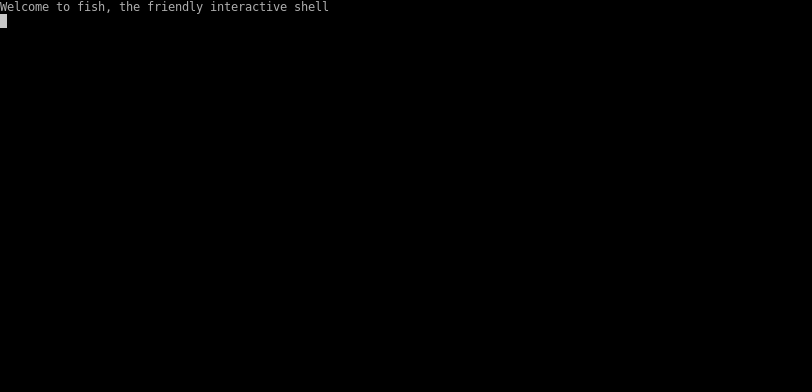

<h1 align="center">
   
  
   
  Mosaic
   
   
</h1>

  

  

# What is this?

Mosaic is a workspace aimed at developers, ops-oriented people and anyone who loves the terminal.
At its core, it is a terminal multiplexer (similar to [tmux](https://github.com/tmux/tmux) and [screen](https://www.gnu.org/software/screen/)), but this is merely its infrastructure layer.

For more details, read about upcoming features in our [roadmap](roadmap.md).

Right now Mosaic is in its early development stages and is not yet ready for everyday usage.
If you're interested, watch this space or better yet - get involved!

## How to use it?
* Clone the project
* In the project folder, run: `cargo run`

(note that right now Mosaic only supports linux and maybe mac)

Some temporary controls (these will be changed to something more convenient when the project matures a little):
  * ctrl-n - split focused pane vertically
  * ctrl-b - split focused pane horizontally
  * ctrl-m - split largest terminal on screen (vertically or horizontally)
  * ctrl-j - resize focused pane down
  * ctrl-k - resize focused pane up 
  * ctrl-h - resize focused pane left
  * ctrl-l - resize focused pane right
  * ctrl-p - move focus to next pane
  * ctrl-[ - scroll up in focused pane
  * ctrl-] - scroll down in focused pane
  * ctrl-x - close focused pane
  * ctrl-q - quit Mosaic

# What is the current status of the project?

Mosaic is in the last stages of being VT compatible. As much as modern terminals are.
Most things should work inside a terminal pane, but some edge cases don't.

Right now, Mosaic:
  * Successfully renders shells (all experiments have been done with fish-cli).
  * Can split the terminal into multiple horizontal/vertical panes
  * Can resize panes, as well as close them
  * Can scroll up and down inside a pane
  * Can render a vim pane
  * Can render most so called "raw mode" applications that draw a textual user interface and refresh themselves.

Please, don't do anything important with it. It's currently being stabilized and still panics quite a bit. :)

# How do I get involved?

At the moment, the project is in early development and prototyping.
A lot of the work needed to be done is product work (making decisions about what Mosaic will be and do) as well as development work. So note that most tasks would probably involve a little of both.
We're a small team of enthusiasts, and we eagerly welcome people who would like to join in at this early stage.

Because of the above, it's not trivial for us to have issues tagged "Help Wanted" or "Good First Issue", as all work would likely need some prior discussion.
That said, we would absolutely love to have these discussions and to bring more people on. Even if you are unsure of your abilities or have never contributed to open source before.
To get started, join our chat and let us know you're interested in contributing: https://discord.gg/CrUAFH3

We respectfully ask that you do your best to stand by any commitments you make.

And most importantly, please read our [code of conduct](CODE_OF_CONDUCT.md).

# Roadmap
This file contains an ever-changing list of the major features that are either currently being worked on, or planned for the near future.

  * <b>A layout engine</b> that would allow you to define how your panes will be (re)arranged when you open or close them. As well as when you change the terminal window size.
  * <b>Pane types beyond a simple shell prompt</b>, for example:
    - A file explorer (similar to ranger) that opens files for editing in a new pane.
    - A launcher that opens any command you enter in a new pane
    - A command pane that would run any command, display its output and re-run that command when clicked. Changing its frame colour to green/yellow/red depending on the exit status.
  * <b>A Webassembly plugin system for compiled languages</b> built using WASI to allow you to write plugins in any compiled language. These plugins would be able to create new panes, interact with existing ones, interact with the filesystem and subscribe to events. You could consume them at runtime and decide what permissions to give them.
  * <b>Built in support for portable workspaces across machines, projects and teams</b>: imagine being able to include a configuration file with your project that would include all the layouts and plugins that would best help new developers getting onboarded. Including all the shortcuts, customized panes and help-message hints triggered by things such as opening a file, entering a folder or running a command. How about being able to log into a new server or container, start mosaic with a URL of a git repository including your favorite configuration and plugins, and working with it as if you were on your own machine?
  * <b>Support for multiple terminal windows across screens</b>: Why limit yourself to one terminal window? Mosaic would allow you to transfer panes, view powerlines, get alerts and control your workspace from different windows by having them all belong to the same session.

# License

MIT
